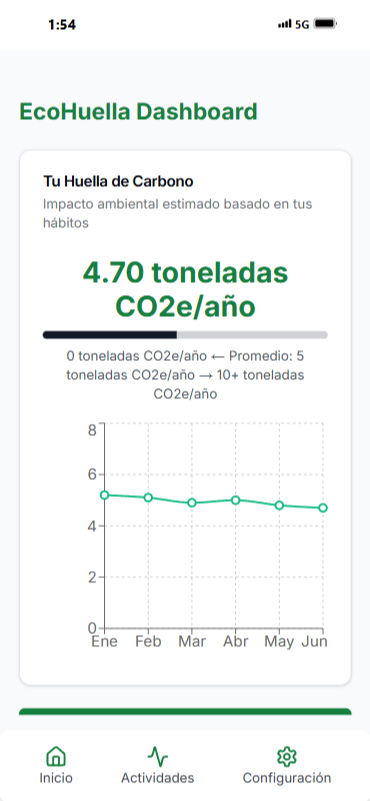
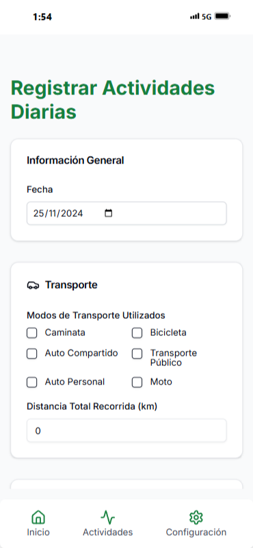

# 📱 EcoHuella Mobile: Seguimiento Personal de Huella de Carbono (Demo PWA)

<p align="center">
   
</p>

## 📊 Sobre la Aplicación Móvil (Demo PWA)

EcoHuella Mobile es una demostración de la extensión para empleados de nuestra solución integral de gestión de huella de carbono. Desarrollada como parte del proyecto EcoHuella para el curso de Emprendimiento Tecnológico en la carrera de Ingeniería en Sistemas de Información.

**Nota Importante:** Esta versión es una demo de una Progressive Web App (PWA) que se enfoca principalmente en el diseño del front-end con funcionalidad mínima/simulada. No representa un producto completamente funcional en esta etapa.

### 👥 Equipo

- Giuliano Benicio Charra Marquez
- Abril Barragán

## 🚀 Características Principales (Simuladas)

- 👤 Perfil personal de huella de carbono
- 📝 Registro diario de actividades
- 📊 Visualización de estadísticas personales
- 🏆 Desafíos y recompensas por reducción de emisiones
- 📰 Noticias y consejos eco-amigables
- 🔔 Notificaciones y recordatorios personalizados

## 🛠 Tecnologías Utilizadas

- 
- 
- 

## 🚀 Comenzando

Para iniciar el proyecto en tu entorno local:

1. Clona el repositorio:
   ```bash
   git clone https://github.com/tu-usuario/ecohuella-mobile.git
   ```

2. Navega al directorio del proyecto:
   ```bash
   cd ecohuella-mobile
   ```

3. Instala las dependencias:
   ```bash
   npm install
   ```

4. Inicia la aplicación:
   ```bash
   npm start
   ```

5. Abre la URL proporcionada en tu navegador móvil para ver la PWA en acción.

## 📸 Capturas de Pantalla

<p align="center">
   
   
</p>

## 📚 Guía de Usuario

Para obtener información detallada sobre cómo usar la demo de EcoHuella Mobile PWA, consulta nuestra [guía de usuario](./docs/USER_GUIDE.md).

## 🔧 Configuración y Desarrollo

Si eres un desarrollador interesado en explorar o contribuir a esta demo, revisa nuestra [guía de desarrollo](./docs/DEVELOPMENT.md) para instrucciones detalladas sobre la configuración del entorno y las mejores prácticas.

## 🤝 Contribuir

Aunque esta es una demo, ¡tus sugerencias son bienvenidas! Por favor, lee nuestra [guía de contribución](CONTRIBUTING.md) para conocer cómo puedes ayudar a mejorar EcoHuella Mobile.

## 📄 Licencia

Este proyecto de demostración está licenciado bajo la Licencia MIT. Consulta el archivo [LICENSE](LICENSE) para más detalles.

## 📞 Soporte

Si tienes preguntas o sugerencias sobre esta demo, por favor crea un issue en este repositorio o contáctanos:

- 📧 Email: support@ecohuella.com
- 💬 Chat en vivo: Disponible en la aplicación demo
- 📱 Redes sociales: [@EcoHuellaMobile](https://twitter.com/EcoHuellaMobile)

---

Desarrollado con 💚 por el equipo de EcoHuella
